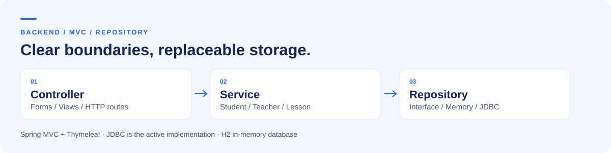
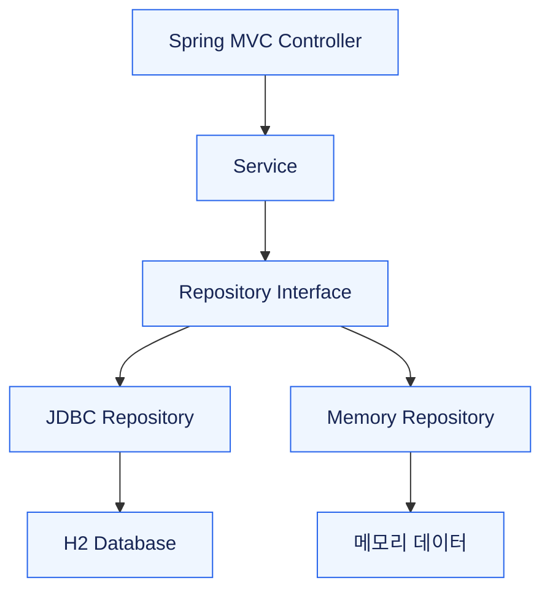
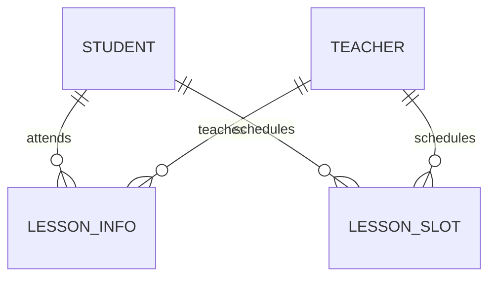

# Minuet

**학생·강사·레슨을 관리하며, 저장소 인터페이스로 메모리와 JDBC 구현을 분리한 Spring MVC 프로젝트**

**개인 프로젝트** · 조동휘: 설계·구현

[설계 포인트](#설계-포인트) · [화면 경로](docs/ROUTES.md) · [실행 방법](docs/SETUP.md) · [검증 기록](docs/VALIDATION.md)

<picture>
  <source media="(max-width: 600px)" srcset="docs/assets/overview-mobile.svg">
  
</picture>

## 프로젝트 개요

음악 학원과 개인 교습소의 학생·강사 정보, 레슨 기록, 반복 시간표를 다루는 관리 서비스입니다. Spring MVC의 요청 처리와 계층 분리를 직접 구현하고, 메모리 저장소에서 JDBC 저장소로 교체할 수 있도록 데이터 접근을 인터페이스 뒤에 분리했습니다.

| 영역 | 다루는 정보 |
| :--- | :--- |
| 학생·강사 | 이름, 수강 횟수, 담당 과목 |
| 레슨 기록 | 학생·강사, 수업 일시, 완료 여부 |
| 레슨 시간표 | 학생·강사, 요일, 시간 |

현재 웹 컨트롤러는 **등록·목록 조회**를 제공합니다. 서비스·저장소 계층의 수정·삭제 구현은 웹 화면 기능과 구분합니다.

## 설계 포인트

### 01. 저장 방식과 서비스 책임 분리

서비스는 저장소 인터페이스에 의존합니다. 메모리 구현과 JDBC 구현을 각각 두고, `AppConfig`에서 실제 사용할 구현을 연결합니다.

기본 구성은 **JDBC**입니다. 저장 방식은 설정 코드를 통해 교체하며, 런타임 자동 전환 기능은 아닙니다.

[의존성 구성](src/main/java/com/ZandhiDokkie/minuet/config/AppConfig.java) · [저장소 인터페이스](src/main/java/com/ZandhiDokkie/minuet/repository/interfaces) · [JDBC 구현](src/main/java/com/ZandhiDokkie/minuet/repository/jdbc)

### 02. 레슨 기록과 반복 시간표 구분

특정 날짜의 레슨 기록(`LessonInfo`)과 요일·시간 기준의 시간표(`LessonSlot`)를 별도로 모델링했습니다. 두 모델은 학생과 강사를 참조합니다.

[도메인 모델](src/main/java/com/ZandhiDokkie/minuet/domain) · [DB 스키마](src/main/resources/schema.sql)

### 03. 계층별 동작과 오류 시나리오 테스트

정상 동작뿐 아니라 존재하지 않는 학생·강사·레슨을 조회하거나 수정·삭제하는 경우를 테스트 코드로 표현했습니다.

| 구분 | 확인하려는 동작 | 코드 |
| :--- | :--- | :--- |
| 서비스 | 학생 등록·조회·수정·삭제 | [테스트](src/test/java/com/ZandhiDokkie/minuet/service/StudentServiceTest.java) |
| 저장소 | 메모리·JDBC 데이터 접근 | [테스트](src/test/java/com/ZandhiDokkie/minuet/repository) |
| 웹 | 요청과 화면 처리 | [테스트](src/test/java/com/ZandhiDokkie/minuet/controller) |
| 오류 | 존재하지 않는 데이터 처리 | [테스트](src/test/java/com/ZandhiDokkie/minuet/integration/ErrorScenarioTest.java) |

실제 실행 결과와 현재 막히는 부분은 [검증 기록](docs/VALIDATION.md)을 참고하세요.

## 실행과 코드 탐색

- [실행 방법](docs/SETUP.md): JDK 17, Gradle Wrapper, H2 초기화와 데이터 유지 범위
- [화면 경로](docs/ROUTES.md): 실제 컨트롤러의 대소문자를 반영한 URL
- [서비스 계층](src/main/java/com/ZandhiDokkie/minuet/service): 비즈니스 처리
- [화면 템플릿](src/main/resources/templates): Thymeleaf 기반 화면

## 현재 한계와 다음 개선

- 수정·삭제 동작을 웹 컨트롤러와 화면까지 연결할 필요가 있습니다.
- 요일·시간 입력 검증과 시간표 중복 검사를 보강할 예정입니다.
- H2 메모리 DB는 애플리케이션 종료 후 데이터를 유지하지 않습니다.
- 실행·테스트에서 발견한 초기화 문제는 [검증 기록](docs/VALIDATION.md)에 별도로 정리합니다.

학습 배경

Spring Boot의 기본 구조, MVC 요청 처리, 계층형 설계, JDBC 데이터 접근과 테스트 작성을 학습하기 위해 진행한 개인 프로젝트입니다. 이 README에서는 학습 목표와 실제 구현 범위를 구분해 기록합니다.

